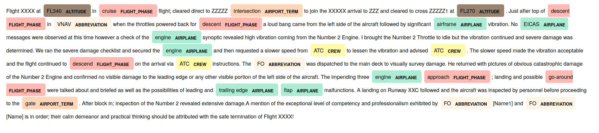
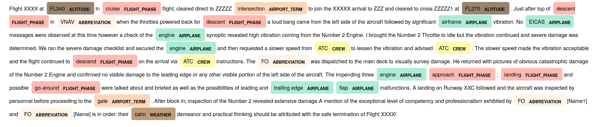

## Avisaf
Avisaf is a tool used for **creating**, **training** and **testing** spaCy-based
Named Entity Recognition (NER) models in Aviation Safety Reports.

### Installation 

Avisaf is now available primarily for Unix-like OS:

Please run `$ ./install.sh` script which installs the application and also 
downloads spaCy default English language model.
     
### How to launch the application

* Application can be started by typing `avisaf` + one of the following 
commands: `test`, `train`, `autobuild`, `build`.  
Example: `avisaf test [additional arguments]`
    
* Feel free to add `-h` parameter anytime if you're in doubt about how
the program should be used.

### Documentation

Read more details about avisaf in the documentation available [here].

[here]: http://www.ms.mff.cuni.cz/~bujkov/avisaf/index.html
     
### Program description

The program consists of 3 different NER model creation steps which 
will be described below:

* avisaf \[auto]build
* avisaf train
* avisaf test
    
#### \[auto]build
Both **build** and **autobuild** are subcommands responsible for **creation** of 
annotated training data. The goal is to create a list of (start, end, label) tuples,
where each tuple describes starting and ending indexes of an entity as well as the 
label attributed to the entity. Only then may such annotated data be used for new 
model training.   
  
Automatic annotation ([autobuild]) makes use of spaCy [Matcher] and [PhraseMatcher] 
objects. Firstly, texts dedicated for annotation have to be loaded either as raw 
strings without any annotation from a CSV file or as tuples (from JSON file) which 
contain a text string and a dictionary holding the set of existing entities under 
"entities" key. Entities recognition in autobuild is based on rules matching, 
which means that the rules (referred to as patterns) have to be loaded from a user 
given pattern-file as well. This [link] provides more details and information 
about rule-based matching and pattern formats. After that, the patterns are looked 
for in each text, and for every match, starting index, ending index and user 
provided label are used for tuple creation. However, one additional step needs 
to be done before saving the final result. Since each token may be part of only 
one entity and the technique described above may create entity overlaps, such 
conflicts must be resolved. Overlap resolution is done by sorting the entities 
by their starting index, and then deleting shorter entity. Even though such 
solution is not perfect, it provides quite satisfactory results most of the time.
Finally, the new data can be saved or printed based on user preference and be 
used for training purposes.      

Manual annotation ([build]) leads to the same result as above despite several 
differences. Firstly, manual annotation can only be performed on the texts from 
a CSV file (path given as parameter) or on the texts written by user to the 
standard input. When extracting the texts from CSV, the user is able to limit the 
number of extracted texts by providing the start index and the number of lines 
to be read. Then, each of these texts is printed to the standard output and the 
user is prompted to write all the words he/she wants to annotate. He/she is given
the list of all available entity labels or 'NONE' if a word was typed in 
accidentally. After all the texts were annotated, the entity list is cleaned 
from overlaps and saved or printed as above.

#### train
Train subcommand performs the training of a new Named Entity Recognizer model.  

In order to recognize new entities or improve the entity recognition, the trained
model needs the training data - in this case it is a set of texts along with the 
list of annotations we want the model to learn. The training data should represent
what the entity recognizer will see during tests. Also, when training a new entity 
type, other entities should be mixed into the the data too in order to avoid entity
'forgetting'.  

During the training, the model labels a text (from the training data) based on 
its statistical predictions. Then, these predicted named entities are compared 
with the set of expected named entities, which makes it possible to evaluate 
precision of the current prediction. After evaluation of the difference between 
the outputs, a new, updated model is created and can be saved or reused for 
further entity prediction.  
For training, [train_spaCy_model method] is used. Firstly, expected entity 
labels, training data and the NER model to be trained are loaded. Then, the 
training itself begins. The set of texts used for training is divided into 
smaller batches later used in the [update method]. The output of the method is 
the updated Named Entity Recognizer model. In order to get best results 
possible, whole process needs to be repeated several (approx. 15 - 25) times.   

#### test
This subcommand allows the user to check, how a given NER model performs on a 
new, so far not analyzed text. The text can be given as a string argument, or 
as a path to the file containing the text. Otherwise, a prepared text sample 
is used for the analysis.  
 
Recognized named entities can be delivered to the user in several different 
ways based on the given arguments. The result can be printed to the standard 
output, with all the named entities and their labels highlighted. Another way 
of showing the result is by using the renderer, which shows the result in the 
default browser. User also has the possibility of saving such generated html 
file by using the appropriate arguments with the desired target file name. 
Click [here] for more details about testing method.

[here]: http://www.ms.mff.cuni.cz/~bujkov/avisaf/main.html#main.main.test

### Obtained results

During the composition of the final NER model, the model was being trained 
progressively on several thousands of example texts. The training data were 
built using several different methods. None of the testing texts was analyzed 
by the model during the training phase.

The first technique used was the manual annotation of dozens of texts. This 
technique led to the model able to recognize different named entities. However, 
the first model often recognized wrong entities, did not recognize some of them 
or labeled them with wrong label.
  

Since the results were not satisfactory enough, another, automatic annotation 
approach was tried. There was a separate file containing a set of keywords for 
each desired named entity. Then, the texts were annotated using [PhraseMatcher] 
object leading to a significant improvement in entity recognition.  

Strict rules restrictions stemming from PhraseMatcher usage led to the problems 
with recognition of some entities (composed names, misspelling, different word forms etc..).

Another step in the NER model improvement was the analysis of some of the reports. 
This led to the change in the way of writing the pattern matching rules. [Matcher] 
object allowed to write rules which accept not only the same words as before, but
also compound names, modifiers of certain words etc... 
   

[autobuild]: http://www.ms.mff.cuni.cz/~bujkov/avisaf/trainer.html#trainer.training_data_creator.annotate_auto
[build]: http://www.ms.mff.cuni.cz/~bujkov/avisaf/trainer.html#trainer.training_data_creator.annotate_man
[link]: https://spacy.io/usage/rule-based-matching#matcher
[Matcher]: https://spacy.io/api/matcher
[PhraseMatcher]: https://spacy.io/api/phrasematcher
[train_spaCy_model method]: http://www.ms.mff.cuni.cz/~bujkov/avisaf/avisaf.trainer.html#avisaf.trainer.new_entity_trainer.train_spaCy_model
[update method]: https://spacy.io/api/entityrecognizer#update

&copy; Viktor Bujko 2020
