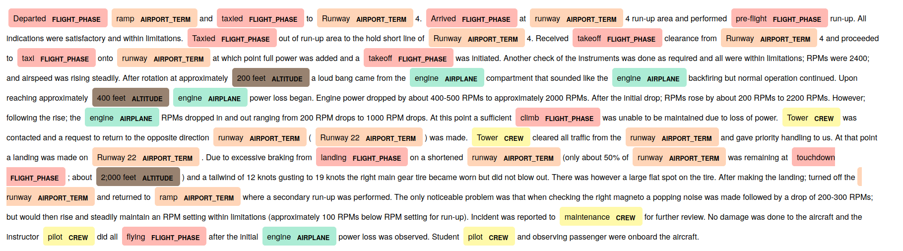
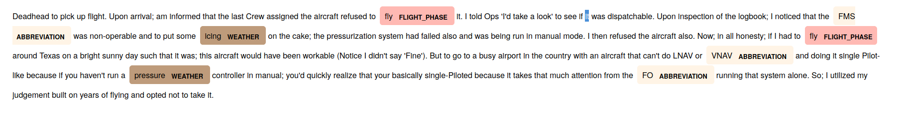

## Named entity recognition in Aviation safety reports

TBD

### Installation 
For Unix-like OS:  
   * `./install.sh` - script uses setup.py for Python application build and install and also downloads spaCy default English language model.
     
### Start the application
   * Application can be started by typing `avisaf` + one of the following commands: `test, train, autobuild, build`
   * Program shows usage and help messages if no other arguments are provided.
   
### Program documentation

TBD

### Examples

&copy; Viktor Bujko 2020

